# Stadium Flow: Smart AI Rerouting MVP

Welcome to the **Stadium Flow App**, an AI-powered crowd management system designed to optimize fan flow and reduce wait times at major sporting events using real-time predictive analytics and Google Gemini.

This app is an MVP (Minimum Viable Product) that demonstrates the core functionality of the system.

🚀 **[Access the Deployed Application](https://stadium-flow-ai-415793168784.us-central1.run.app/)**

📄 **[Download the Technical Case Study (PDF)](Agentic_Logic_Blueprint.pdf)**

📄 **[Read the Agentic Logic Blueprint (Markdown)](BLUEPRINT.md)**

## System Architecture

The system consists of three main components:



1. **Orchestration Layer (FastAPI):** Manages a SQLite database of stadium zones and hosts a background simulation engine.

2. **Presentation Layer (Streamlit):** A role-based dashboard separating Admin analytics from Guest/Fan navigation.

3. **Cognitive Layer (Gemini 2.5 Flash):** Analyzes occupancy data and generates natural language routing recommendations using Gemini 2.5 Flash.

---

## Quick Start

To make it easy for the users to review the project, one-click scripts for setup and execution have been included.

### 1. One-Click Setup

Open PowerShell in the project root and run:

```powershell
./setup.ps1
```

*This script will create the virtual environment, install all dependencies, initialize the database, and create a template `.env` file.*

### 2. Configure AI

Open the newly created `.env` file and add your Google Gemini API Key:

```env
GEMINI_API_KEY=your_actual_api_key_here
```

### 3. Run the App

Once setup is complete, launch the entire stack with:

```powershell
./run.ps1
```

---

## Manual Installation (Optional)

If you prefer to set up the environment manually:

1. **Create Venv**: `python -m venv .venv`
2. **Install Deps**: `pip install -r requirements.txt`
3. **Init DB**: `python backend/setup_db.py`

---

## Features & User Roles

To ensure a streamlined, progressive experience, the app separates technical analytics from consumer usage.

### Fan View (Guest)

1. **No Login/Signup Required:** Fans land directly on a simplified, frictionless navigation screen.

2. **Location Selection:** Fans select their current stand or washroom location.

3. **AI Smart Rerouting:** The engine analyzes crowd patterns, and computes the quickest route with flawless math, then uses AI to translate those coordinates into simple instructions you can actually read.

### Admin Dashboard (Secured)

1. **Predictive Logging:** A dedicated sidebar tracks historical occupancy trends for the AI to analyze.

2. **Critical Alerts:** The system flags any zone exceeding 90% capacity.

3. **Raw Data Access:** Admins can expand the raw dataframe to see exact occupancy vs capacity metrics.

4. **Stress-Testing Parameters:** You can log in using the Admin credentials (`admin` / `admin`) to view predictive logging logs, alter transactional states, and witness real-time 10s sensor ingestion pulses.

    *Note: these credentials are for the **MVP only** and future versions will have proper authentication as well as authorization.*

---

## Cloud Deployment (Google Cloud Run)

This project is Docker-ready for deployment to Google Cloud Run.

### 1. Build the Image

Build and push your container to Google Container Registry (replace `PROJECT_ID` with your actual project id):

```bash
gcloud builds submit --tag gcr.io/PROJECT_ID/stadium-flow-ai
```

### 2. Deploy to Cloud Run

Launch the service with your Gemini API key:

```bash
gcloud run deploy stadium-flow-ai
    --image gcr.io/PROJECT_ID/stadium-flow-ai
    --platform managed
    --region us-central1
    --allow-unauthenticated
    --set-env-vars="GEMINI_API_KEY=your_actual_key_here"
```

---

## Tech Stack & File Structure

* **Database:** SQLite (`stadium_flow.db`) utilizing an `occupancy_logs` table for trend tracking and local state management.

* **Simulation Engine:** `sim_engine.py` runs a concurrent 10-second data injection loop to virtualize hardware sensor telemetry.

* **Cognitive Engine:** Google GenAI API using `gemini-2.5-flash`.

* **Presentation Design:** Custom CSS overrides implemented within Streamlit to enforce a premium dark-mode.

## 📄 License

This project is licensed under the **MIT License**. You are free to use, modify, and distribute the code, provided that the original copyright notice and attribution are included. See the [LICENSE](LICENSE) file for more details.

---

[*Built with 🤍, using Google Gemini & Antigravity as part of the "Build With AI" series*](https://developers.google.com/community/build-with-ai)

## References

* [Streamlit](https://docs.streamlit.io/)
* [FastAPI](https://fastapi.tiangolo.com/)
* [Gemini AI](https://ai.google.dev/gemini-api)
